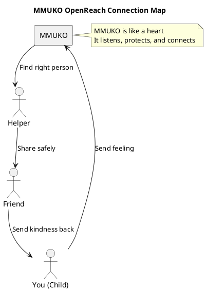

## 🧠 MMUKO NEURODIVERGENT OPENREACH INITIATIVE

**Title:**  
**MMUKO: The Spirit for Good and Evil That Connects Us All**

**Hello!**  
This is a special project made by OBINexus.  
It helps people who think and feel in different ways.  
We call this **neurodivergent** — it means your brain is magical and unique.

---

### 🌱 What is MMUKO?

MMUKO is a system that helps people **reach out** to others.  
It’s like a bridge between **you** and **them**, between **inside** and **outside**, between **feeling** and **doing**.

It’s made for:
- Kids who think in pictures or sounds
- People who feel big emotions
- Anyone who wants to connect safely and kindly

---

### 🧩 What does it do?

- Helps you **send messages** to the right people
- Keeps your feelings **safe**
- Lets you **choose** who you talk to
- Makes sure **no one is left out**

---

### 🖼️ How does it work?

### 💖 Why is this important?

Because **everyone matters**.  
Even if you don’t speak the same way.  
Even if your feelings are big or quiet.  
Even if you feel alone — MMUKO is here to help.

---

### 📦 What’s inside this repo?

- `README.md` — this file!
- `LICENSE` — you can use this freely
- More files coming soon to help you connect

---

### 🌍 Who made this?

OBINexus — a company that builds with **heart** and **soul**.  
We believe when systems fail, you build your own.  
And we did just that.
